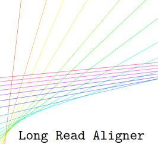
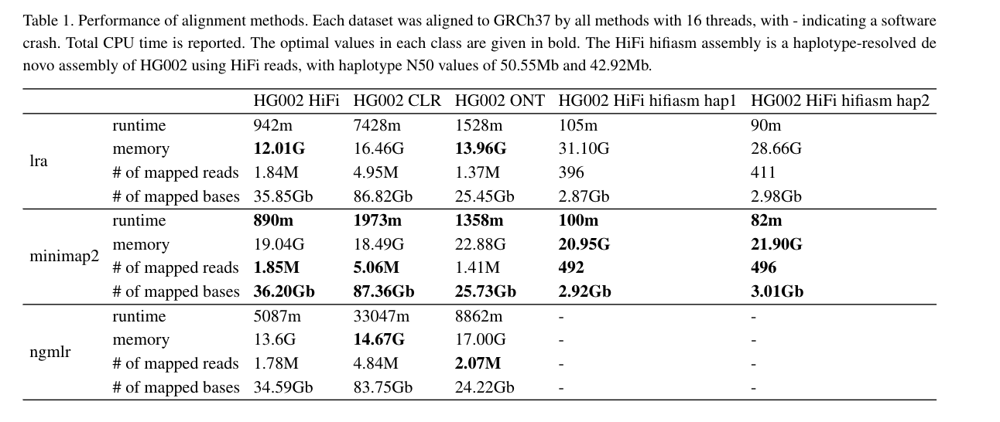
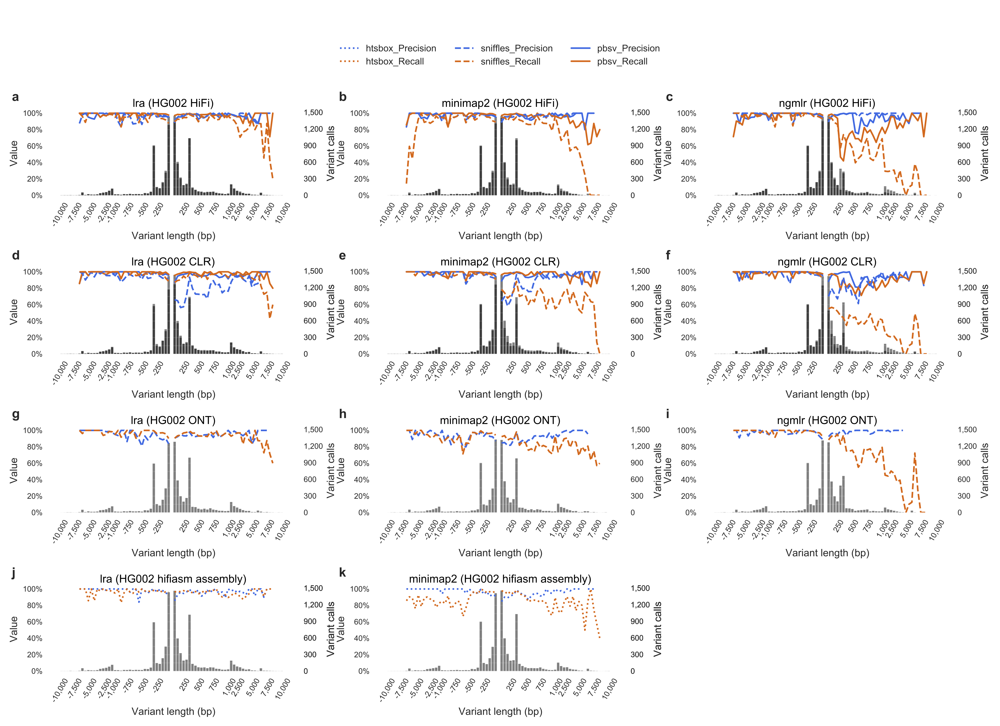

## <a name="started"></a>Getting Started

- [Getting Started](#started)
```sh
# index reference genome
lra index -CCS/CLR/ONT/CONTIG ref.fa
# Map sequence to reference
lra align -CCS/CLR/ONT/CONTIG ref.fa read.fa -t 16 -p s > output.sam  
```
## Table of Contents

- [Introduction](#intro)
- [Users' Guide](#uguide)
  - [Installation](#install)
  - [Index reference](#index)
  - [Align reads/contigs to reference](#align)
  - [Output format](#output)

## <a name="intro"></a>Introduction




<br clear="left"/>
lra is a sequence alignment program that aligns long reads from single-molecule sequencing (SMS) instruments, or megabase-scale contigs from SMS assemblies. lra implements seed chaining sparse dynamic programming with a concave gap function to read and assembly alignment, which is also extended to allow for inversion cases. lra alignment approach increases sensitivity and specificity for SV discovery, particularly for variants above 1kb and when discovering variation from ONT reads, while having runtime that arecomparable (1.05-3.76×) to current methods. When applied to calling variation from \textit{de novo} assembly contigs, there is a 3.2% increase in Truvari F1 score compared to minimap2+htsbox.


## <a name="uguide"></a>Users' Guide

### <a name="install"></a>Installation

Install lra by bioconda: `conda install -c bioconda lra`

Install lra from github or release: The dependencies are [zlib][zlib], [htslib][htslib].
Users can install `zlib` and `htslib` through conda and build lra in conda environment. 
1. `conda activate env`;
2. Install dependency: `conda install -c bioconda htslib` and `conda install -c anaconda zlib`;
3. Get released latest source code from github `wget https://github.com/ChaissonLab/lra/archive/VX.XX.tar.gz && tar -xvf VX.XX.tar.gz && cd lra-X.XX/ && make`. 
   Or get source code directly from the master branch `git clone --recursive https://github.com/ChaissonLab/lra.git -b master && cd lra && make`. You are all set for the installation!


### <a name="index"></a>Index reference
lra needs to first build a two-tiered minimizer indexes (global and local) for the reference before mapping. Both can be built at once using commands:
```
lra index -CCS/CLR/ONT/CONTIG ref.fa
```
lra has different parameters setting for the index when aligning reads from different sequencing instruments (CCS/CLR/ONT/CONTIG). You can also custimize the parameters. Details see `lra index --help`. lra takes a few minutes to index the human reference genome.

Alternatively the global and local indexes may be built separately: 
```
lra global -CCS/CLR/ONT/CONTIG ref.fa
lra local -CCS/CLR/ONT/CONTIG ref.fa
```

### <a name="align"></a>Align reads/contigs to reference
lra takes reads fasta, fastq or bam format in the mapping step. The output format can be SAM, PAF, BED and pairwise alignment. Details see `lra align --help`. The usage of multiple threads can be specified by `-t`. lra uses the same base algorithm for mapping all datatypes with different parameters settings. It is recommended to choose among `CCS/CLR/ONT/CONTIG` based on the accuracy and average length of the input reads. 

```
lra align -CCS/CLR/ONT/CONTIG ref.fa read.fa -t 16 -p s > output.sam  
lra align -CCS/CLR/ONT/CONTIG ref.fa read.fa -t 16 -p p > output.paf  
lra align -CCS/CLR/ONT/CONTIG ref.fa read.fa -t 16 -p b > output.bed
```

If you have read.fa.gz, you may pip the read.fa to lra.

```
zcat read.fa.gz | lra align -CCS ref.fa /dev/stdin -t -p s > output.sam
```

### <a name="output"></a>Output format

lra uses a set of customized tags in SAM and PAF output.

|Tag|Type  |Description                                  						|
|:--|:----:|:-------------------------------------------------------------------|
|NM |i |Number of matches in the alignment                                      |
|NX |i |Number of mismatches in the alignment                                   |
|ND |i |Number of bases of deletions in the alignment                           |
|TD |i |Number of deletions in the alignment                                    |
|NI |i |Number of bases of insertions in the alignment                          |
|TI |i |Number of insertions in the alignment                                   | 
|NV |f |The alignment score                                                     |
|TP |A |Type of aln, P/primary, S/secondary, I/inversion                        |
|RT |i |runtime   									                            |
|CG |z |CIGAR string        						                            |	 
|AO |i |This number shows the order of the aligned segment when a read is split |


[zlib]: http://zlib.net/
[htslib]: https://github.com/samtools/htslib/


